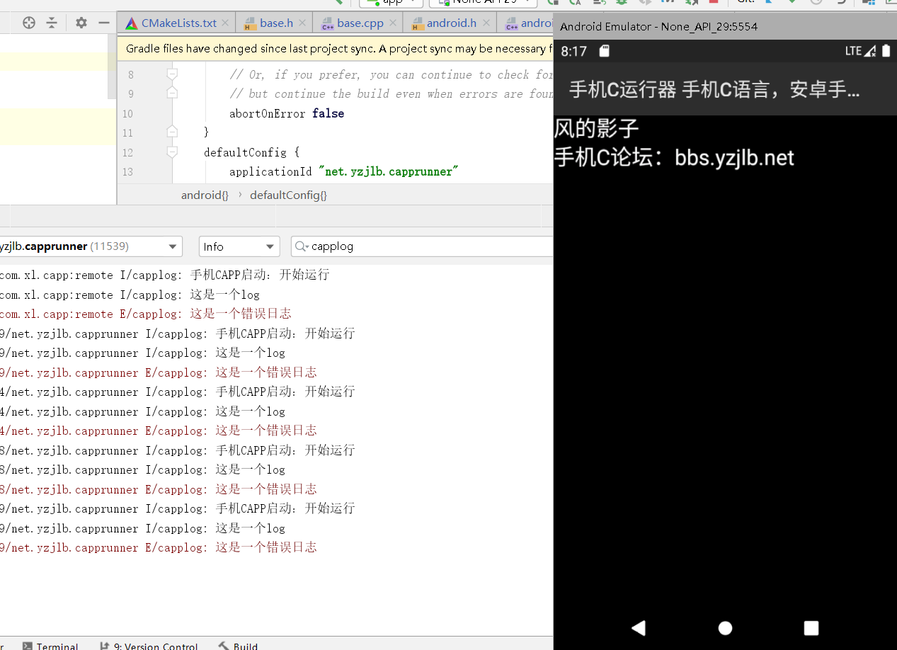

# 电脑端编写手机C代码

手机CAPP是一个手机上用C语言开发app的工具，这个项目就是为了在电脑上调试手机C程序，使用Android Studio编译手机C工程。
项目已初步完善，支持log输出，可直接运行apk，可用Android Studio打包apk



## 环境搭建
1.下载手机CAPP到安卓模拟器上
2.安装gcc编译器
3.使用Android Studio打开本项目

## 运行项目
1.直接使用Android Studio运行

## 如何打印log？
在项目中**#include "android.h"**，然后使用LOGI LOGE等方法进行打印，log信息将输入到Andoid Studio的Logcat面板，搜索“capplog”即可查看手机C的log输出。

```c
    LOGI("手机CAPP启动：%s","开始运行");
    LOGI("这是一个log");
    LOGE("这是一个错误日志");
```


## 为什么运行的是C++？
C++兼容C语言，所以按照C语言的写法完全没有问题，可能编译速度会慢点，可自己手动改成C


## 如何导出apk

导出apk的方法和Android Studio其他项目一样，使用Build->Generate Signed Bundle进行导出。


## 相关链接

手机CAPP下载：http://www.yzjlb.net/app/opmrcc/

手机C论坛：http://bbs.yzjlb.net


